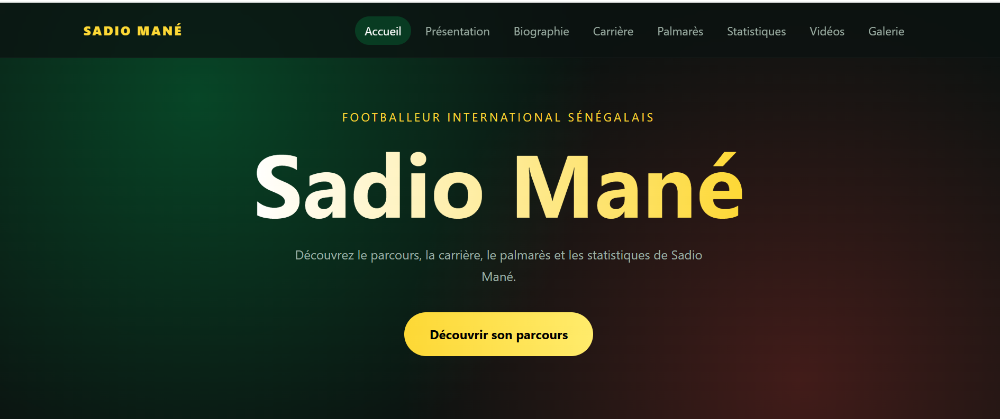
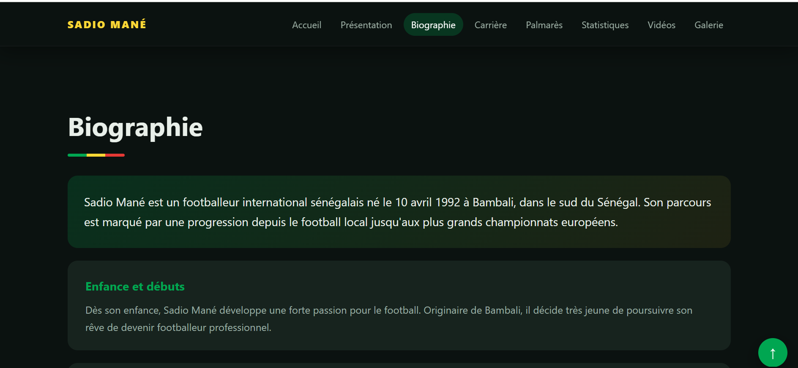
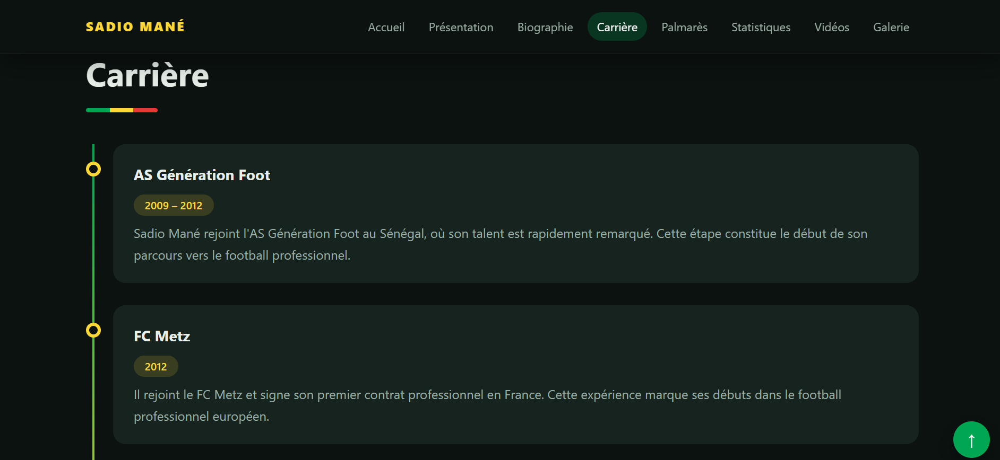
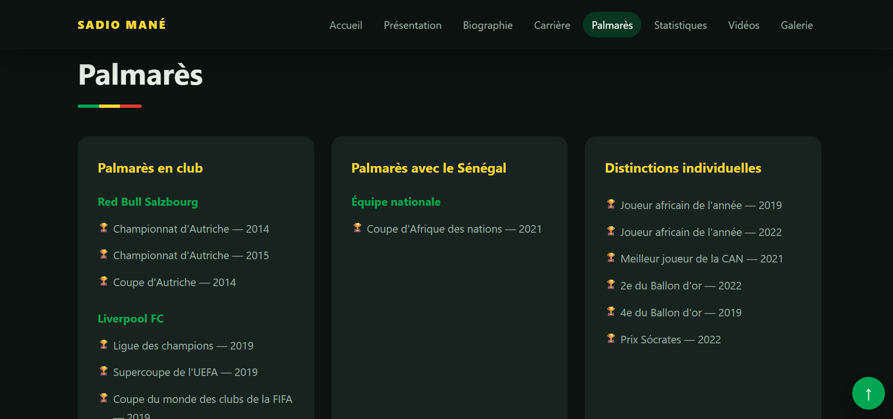
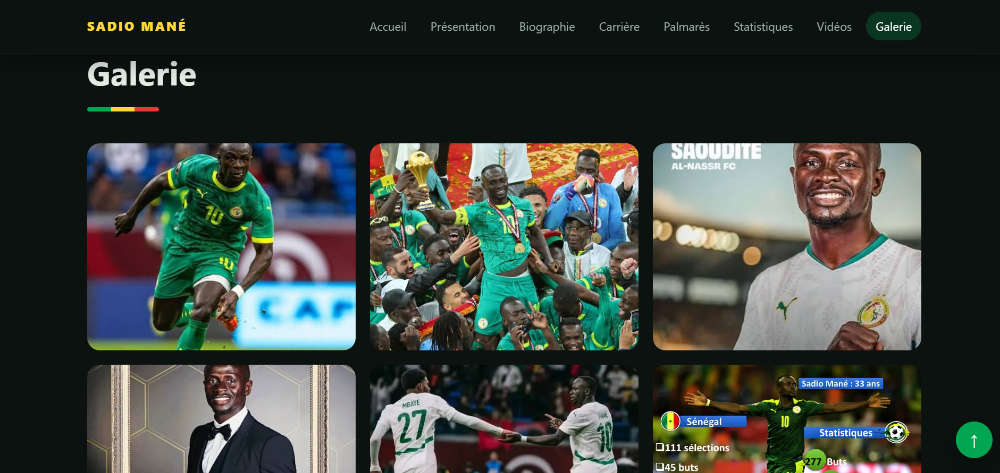
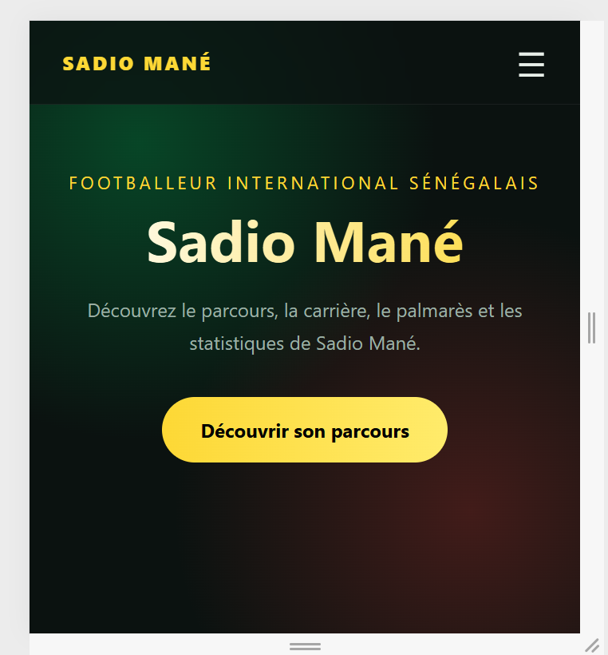

# ⚽ Sadio Mané — Biography & Career

Site web éducatif consacré au parcours, à la carrière, au palmarès et aux statistiques de **Sadio Mané**, footballeur international sénégalais.

> Projet académique réalisé en **HTML, CSS et JavaScript**.

🔗 **Démo en ligne :** [https://AliouServiteurs.github.io/NOM-DU-REPO/](https://AliouServiteurs.github.io/sadio-mane-biography/)

---

## 📸 Aperçu

### Page d'accueil


### Biographie


### Carrière (frise chronologique)


### Palmarès & statistiques


### Vidéos & galerie


### Version mobile


---

## ✨ Fonctionnalités

- Navigation fixe avec liens d'ancrage vers chaque section
- Section d'accueil (hero) avec bouton d'appel à l'action
- Fiche de présentation du joueur
- Biographie découpée en grandes étapes
- Frise chronologique de la carrière (club par club)
- Palmarès : titres en club, avec le Sénégal et distinctions individuelles
- Cartes de statistiques internationales
- Vidéos YouTube intégrées
- Galerie photos
- Design responsive (ordinateur, tablette, mobile)

---

## 🛠️ Technologies

| Technologie | Utilisation |
|---|---|
| **HTML5** | Structure sémantique (`header`, `main`, `section`, `article`, `figure`, `footer`) |
| **CSS3** | Mise en page, Flexbox / Grid, responsive |
| **JavaScript** | Interactions de la page |

---

## 📁 Structure du projet

```
projet-sadio-mane/
├── index.html
├── css/
│   └── style.css
├── js/
│   └── script.js
├── images/
│   ├── hero/
│   │   └── sadio-mane.jpg
│   └── gallery/
│       ├── sadio-mane-01.jpg
│       ├── sadio-mane-02.jpg
│       ├── sadio-mane-03.jpg
│       |── sadio-mane-04.jpg
|       ├── sadio-mane-05.webp
│       └── sadio-mane-06.webp
├── screenshots/          ← captures utilisées dans ce README
└── README.md
```

---

## 🚀 Lancer le projet

```bash
# 1. Cloner le dépôt
git clone https://github.com/AliouServiteurs/sadio-mane-biography.git

# 2. Ouvrir le dossier
cd sadio-mane-biography

# 3. Ouvrir index.html dans le navigateur
```

Aucune installation nécessaire : le projet fonctionne directement dans le navigateur.

---

## 🎯 Objectifs pédagogiques

- Structurer une page avec du HTML sémantique
- Organiser un projet web (dossiers `css`, `js`, `images`)
- Concevoir une interface responsive
- Intégrer des médias (images, vidéos YouTube)
- Publier un projet sur GitHub

---

## 🔮 Améliorations possibles

- [ ] Menu burger pour mobile
- [ ] Mode sombre / clair
- [ ] Animations au défilement
- [ ] Graphiques pour les statistiques
- [ ] Version anglaise du site

---

## ⚠️ Remarque

Projet à but **strictement éducatif**. Les photos et vidéos appartiennent à leurs propriétaires respectifs. Les informations doivent être vérifiées auprès de sources officielles.

---

## 👤 Auteur

**Ton Nom**
- GitHub : [@AliouServiteurs](https://github.com/AliouServiteurs)
- Portfolio : [mon-portfolio.com](https://mon-portfolio.com)
